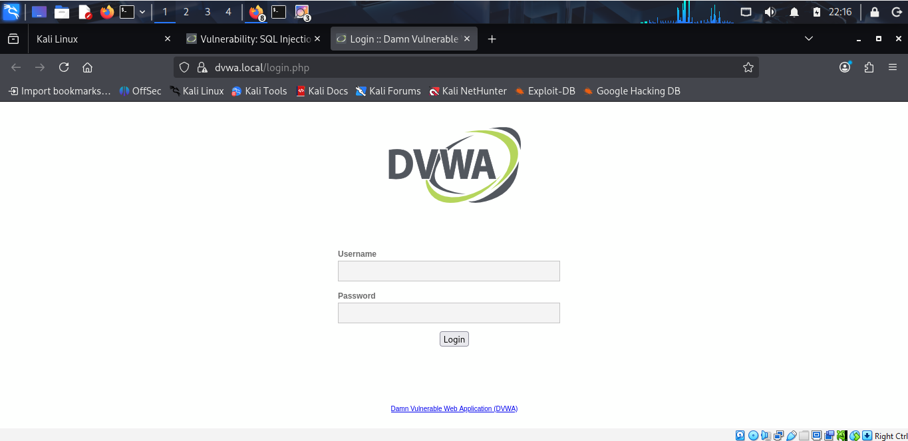
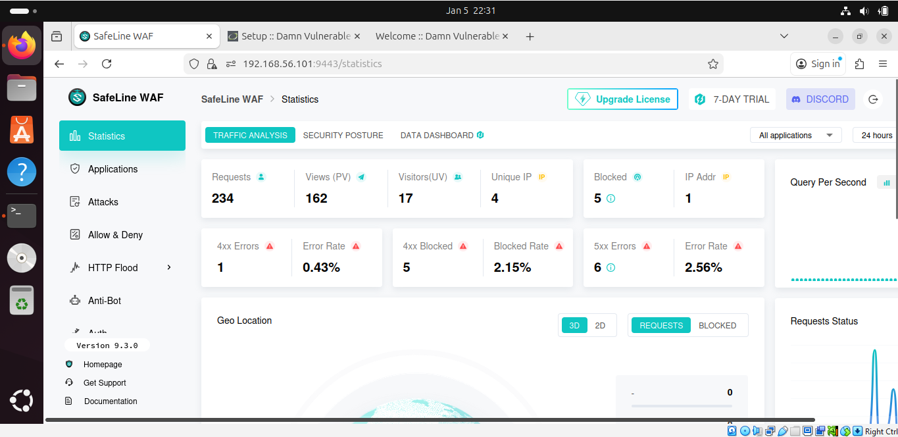
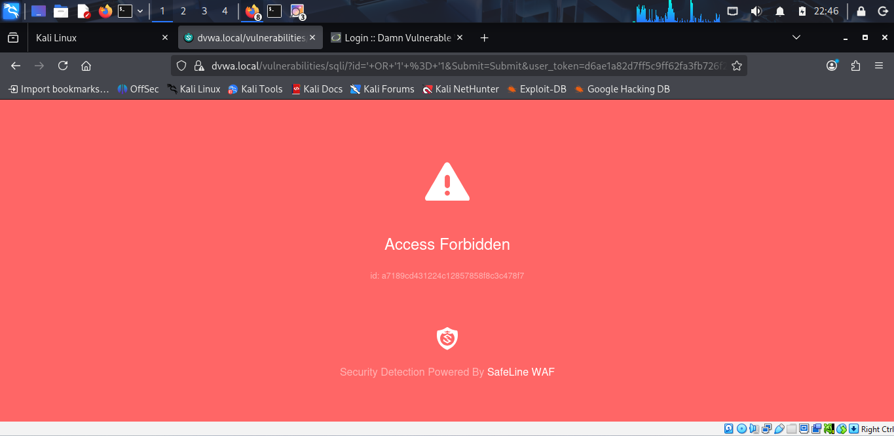

# Web Application Firewall Home Lab

## 🎯 Project Overview
Built a cybersecurity home lab implementing SafeLine WAF to protect a vulnerable web application (DVWA) from common attacks like SQL injection and XSS.

## 🛠️ Technologies Used
- **VMs:** Ubuntu Server, Kali Linux (VirtualBox)
- **Web Stack:** Apache, MySQL, PHP (LAMP)
- **Security:** SafeLine WAF, DVWA
- **Skills:** Linux administration, web security, penetration testing

## 📋 What I Built
1. **Ubuntu Server** - Hosted DVWA on port 8080 with LAMP stack
2. **SafeLine WAF** - Configured reverse proxy with SSL certificates
3. **Kali Linux** - Simulated attacks (SQL injection, XSS)
4. **Security Features:**
   - SQL injection protection ✅
   - XSS filtering ✅
   - HTTP flood defense ✅
   - IP blocking rules ✅
   - Authentication gateway ✅

## 🏗️ Architecture
```
Kali Linux (Attacker) → SafeLine WAF (Port 443) → Ubuntu + DVWA (Port 8080)
```

## 📸 Screenshots
*(Screenshots will be added below)*

### DVWA Login Page


### SafeLine WAF Dashboard


### SQL Injection Blocked


## 🎓 Skills Demonstrated
- Web Application Firewall configuration
- Linux system administration (Ubuntu)
- Penetration testing (Kali Linux)
- Network security and segmentation
- SSL/TLS certificate management
- Attack detection and mitigation

## 📚 Setup Process
1. Installed Ubuntu Server and Kali Linux on VirtualBox
2. Configured LAMP stack (Apache, MySQL, PHP)
3. Deployed DVWA on custom port 8080
4. Installed and configured SafeLine WAF
5. Created self-signed SSL certificates
6. Set up DNS resolution with /etc/hosts
7. Configured WAF rules (SQL injection, XSS, rate limiting)
8. Tested attacks from Kali Linux

## 🎥 Reference
Based on tutorial by Royden Rebello (The Social Dork)
[YouTube Guide](https://youtu.be/N0dEC1nuWCQ)

## 📧 Contact
Marzuq Adepegba
marzkayz@gmail.com
www.linkedin.com/in/adepegba-marzuq
